<h1 align="center">
  API Challenge - Documentation
</h1>

<h2 align="center">
  Information
</h2>
<p align="center">
    This documentation has been created to guide how to install, use and test this challenge project, which consists of a Flutter-based mobile application (frontend) and a Python FastAPI-based API (backend).
</p>

<h2 align="center">
  DISCLAIMER
</h2>
<p align="center">
    This project is for study purposes only. It is NOT an official product of SEMEQ.
</p>

## Summary

  * [1. Project Overview](#1-project-overview)
  * [2. Architecture Overview](#2-architecture-overview)
  * [3. Project Structure](#3-project-structure)
  * [4. Prerequisites](#4-prerequisites)
      * [4.1. Git](#41-git)
      * [4.2. Flutter SDK](#42-flutter-sdk)
      * [4.3. Python](#43-python)
  * [5. Getting Started](#5-getting-started)
      * [5.1. Clone the Repository](#51-clone-the-repository)
      * [5.2. Backend Setup and Run](#52-backend-setup-and-run)
      * [5.3. Frontend Setup and Run](#53-frontend-setup-and-run)
  * [6. Application Screenshots and Usage Flow](#6-application-screenshots-and-usage-flow)
  * [7. Authentication Flow](#7-authentication-flow)
  * [8. API Call Examples](#8-api-call-examples)
      * [8.1. Authentication Endpoints](#81-authentication-endpoints)
      * [8.2. Data Endpoints (Requires Authentication)](#82-data-endpoints-requires-authentication)

## 1\. Project Overview

This project implements a mobile application with a Flutter frontend that interacts with a Python FastAPI backend. The application allows users to log in, view their user data, and query a hierarchical "tree" structure based on a site ID. The backend acts as an intermediary, handling authentication (token management) and fetching data from an external API.

## 2\. Architecture Overview

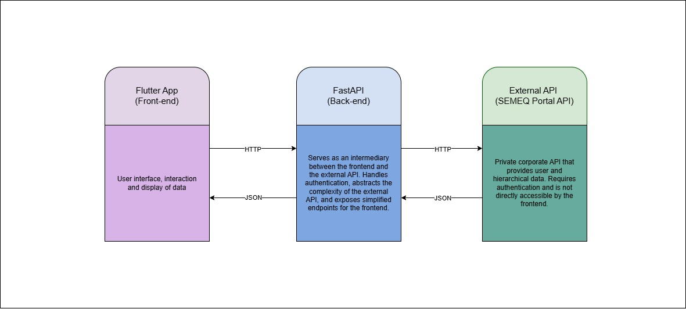

The data flow usually starts from the frontend, which sends requests to the backend. The backend, in turn, processes these requests, interacts with the external API, and returns the responses to the frontend.

## 3\. Project Structure

The repository is organized as follows:

```
desafio-api-python/
│
├── app/                    # FastAPI Backend
│   ├── auth/               # Authentication modules (handlers, models)
│   │   ├── handlers.py     # Token handling logic
│   │   └── models.py       # Pydantic models for authentication
│   ├── routes/             # API endpoint definitions
│   │   └── endpoints.py
│   ├── services/           # Logic for integration with the external API
│   │   └── portal.py
│   ├── main.py             # Main FastAPI application file
│   ├── config.py           # Configuration and environment variables
│   └── .env                # File for environment variables (not versioned)
│
├── frontend_flutter/       # Flutter Application
│   ├── lib/                # Main source code of the application
│   │   ├── main.dart       # Entry point of the Flutter app
│   │   ├── pages/          # Screen widgets (Login, Home, User, Tree)
│   │   ├── providers/      # State management (AuthProvider)
│   │   ├── services/       # API communication logic (ApiService)
│   │   └── models/         # Frontend data models
│   ├── android/            # Android platform-specific files
│   ├── ios/                # iOS platform-specific files
│   └── pubspec.yaml        # Flutter project dependencies and metadata
│
├── readme_images/          # Images used in the README
│
├── .gitignore              # Files and directories ignored by Git
├── README.md               # This documentation file
└── requirements.txt        # Python dependencies for the backend
```

-----

## 4\. Prerequisites

Before you begin setting up the project, ensure you have the following system-level tools installed:

### 4.1. Git

Git is required to clone the repository.
If you don't have Git installed, download and install it from the official website: [Git Downloads](https://git-scm.com/downloads).

### 4.2. Flutter SDK

The Flutter SDK is required for the frontend application.
Install Flutter by following the official guide: [Flutter Get Started](https://flutter.dev/docs/get-started). Ensure that the `flutter` command is in your system's PATH.

### 4.3. Python

Python is required for the backend API.
Ensure you have Python 3.8+ installed. You can download it from the [official Python website](https://www.python.org/downloads/). Ensure that `python` and `pip` commands are in your system's PATH.

-----

## 5\. Getting Started

This section guides you through cloning the repository, installing project-specific dependencies, and running both the backend and frontend applications.

### 5.1. Clone the Repository

Once Git is installed (as per [Section 4.1](#41-git)), open your terminal or command prompt, navigate to your desired workspace directory, and run the following command:

```bash
git clone https://github.com/vlenci/desafio-api-python.git
cd desafio-api-python
```

You should now be in the root directory of the cloned project.

### 5.2. Backend Setup and Run

Follow these steps to set up and run the FastAPI backend. All commands should be run from the project's root directory (`desafio-api-python/`).

1.  **Install Backend Dependencies**:
    The backend Python packages are listed in the `requirements.txt` file. Install them using pip:

    ```bash
    pip install -r requirements.txt
    ```

    The `requirements.txt` should ideally contain:

    ```
    fastapi
    uvicorn
    requests
    python-dotenv
    pydantic
    ```

2.  **Important Note for Testers**:
    To fully test the application, you will need credentials for an external API (`API_EXTERNAL_URL`, `API_USERNAME`, `API_PASSWORD`) which are configured in the `.env` file. **Please contact me to obtain these credentials, if you have permission, i will send them to you.**

3.  **Create `.env` File**:
    The backend uses `python-dotenv` to load environment variables. Create a file named `.env` **inside the `app/` directory** (`desafio-api-python/app/.env`) with the following content, using the credentials obtained:

    ```
    API_EXTERNAL_URL=<YOUR_EXTERNAL_API_BASE_URL>
    API_USERNAME=<YOUR_EXTERNAL_API_USERNAME>
    API_PASSWORD=<YOUR_EXTERNAL_API_PASSWORD>
    ```

    Replace `<YOUR_EXTERNAL_API_BASE_URL>`, `<YOUR_EXTERNAL_API_USERNAME>`, and `<YOUR_EXTERNAL_API_PASSWORD>` with the actual credentials.

4.  **Run the FastAPI Application**:
    From the **root directory** of the project (e.g., `desafio-api-python`), run the following command:

    ```bash
    uvicorn app.main:app --reload
    ```

    This will start the FastAPI server, typically accessible at `http://127.0.0.1:8000`. The `--reload` flag enables auto-reloading on code changes.

### 5.3. Frontend Setup and Run

Follow these steps to set up and run the Flutter frontend application.

1.  **Navigate to the Frontend Directory**:
    From the project's root directory (`desafio-api-python/`), navigate to the frontend:

    ```bash
    cd frontend_flutter
    ```

2.  **Get Flutter Packages**:
    Install the Dart packages listed in `frontend_flutter/pubspec.yaml`:

    ```bash
    flutter pub get
    ```

    The main packages are:

      * `http`: Used for making HTTP requests to the backend.
      * `provider`: A state management solution for Flutter.

3.  **Ensure the Backend is Running**:
    The Flutter app connects to the backend, by default at `http://10.0.2.2:8000` (this IP is typically used by Android emulators to refer to the host machine's `localhost`). Make sure your FastAPI backend (from [Section 5.2.4](#52-backend-setup-and-run)) is running and accessible. If your backend is on a different IP/port, or you're using a physical device, update the `baseUrl` in `frontend_flutter/lib/services/api_service.dart`.

4.  **Run the Flutter Application**:
    You can run the application on an attached device or an active emulator:

    ```bash
    flutter run
    ```

    Or, to run on a specific device if multiple are connected:

    ```bash
    flutter run -d <device_id>
    ```

-----

## 6\. Application Screenshots and Usage Flow

This section provides a visual overview of the application's main screens and user flow.

1.  **Login Screen**:
    The user starts at the login screen to enter their credentials.


    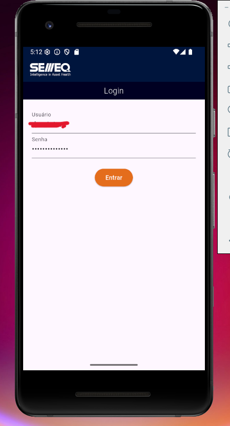

    <br>
2.  **Home Screen**:
    After a successful login, the user is directed to the home screen, which provides options to view user data or consult the tree of a site.

    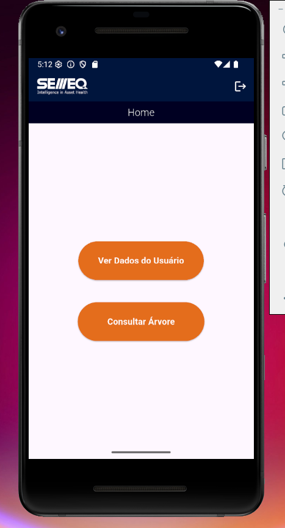

    <br>
3.  **User Data Screen (`/usercorp`)**:
    Selecting "Ver Dados do Usuário" (View User Data) navigates to a screen that displays the user's corporate information retrieved from the API. This screen is important as it contains all the `site_id`, which is necessary for querying the tree structure.
    
    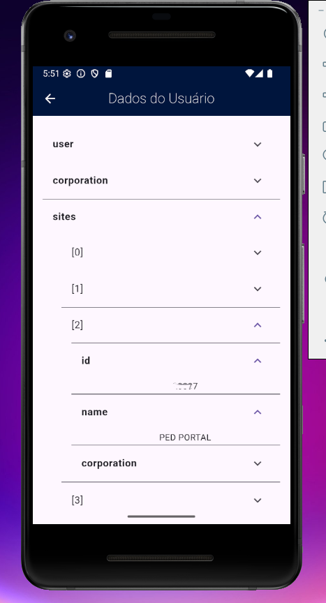
    
    <br>
4.  **Tree Query Screen (`/implantation/mobile/tree`)**:
    Selecting "Consultar Árvore" (Consult Tree) navigates to a screen where the user can input a `site_id`. This ID can be found in the user's data from the previous screen. Upon entering the `site_id` and submitting, the application fetches and displays the corresponding hierarchical tree structure.

    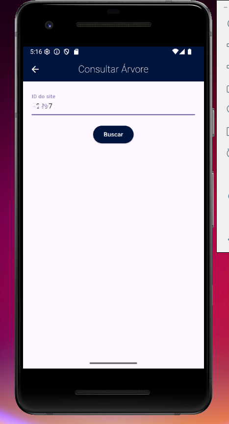
    
    <br>

    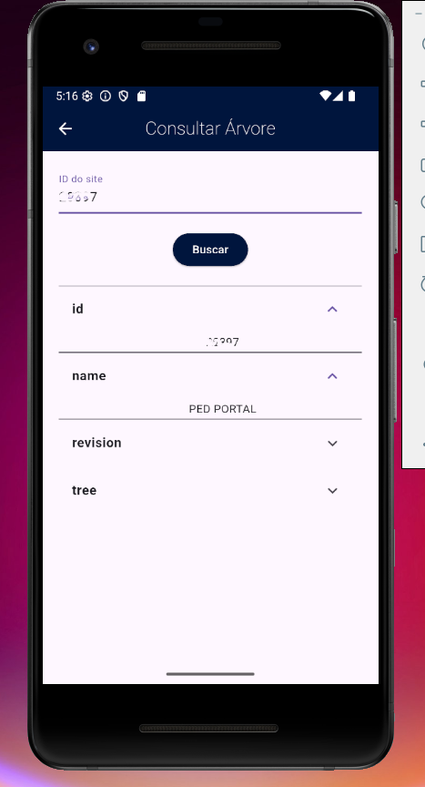
    <br>

**User Flow for Tree Consultation:**
To effectively use the "Consultar Árvore" feature:

1.  Log in to the application.
2.  Navigate to "Ver Dados do Usuário" to view your user information and identify the relevant `site_id` from `sites` list.
3.  Navigate to "Consultar Árvore".
4.  Input the `site_id` obtained from your user data into the designated field.
5.  Submit the query to view the tree structure.

## 7\. Authentication Flow

The authentication process uses JWT (JSON Web Tokens) and involves the following steps:

1.  **Login (`/token`)**:

      * The user provides `username` and `password` via the frontend.
      * The backend authenticates these credentials against the external API.
      * If successful, the backend generates two tokens:
          * `access`: A short-lived token used to authenticate subsequent requests to protected endpoints.
          * `refresh`: A longer-lived token used to obtain a new `access` when the current one expires, without requiring the user to log in again.
      * Both tokens are sent back to the frontend.

2.  **Using the Access Token**:

      * For every request to a protected endpoint (e.g., `/usercorp`, `/implantation/mobile/tree`), the frontend must include the `access` in the `Authorization` header as a Bearer token:
        ```
        Authorization: Bearer YOUR_ACCESS_TOKEN
        ```
      * The backend validates this token before processing the request.

3.  **Token Validation (`/token/verify`)**:

      * This endpoint can be used to check if an `access` is still valid.
      * The frontend sends the `access`.
      * The backend verifies its signature and expiration. It returns a confirmation or an error.

4.  **Token Renewal (`/token/refresh`)**:

      * When an `access` expires, or is about to expire, the frontend can use the `refresh` to request a new `access`.
      * The frontend sends the `refresh` to the `/token/refresh` endpoint.
      * The backend validates the `refresh`. If valid, it issues a new `access`.
      * This allows the user to stay logged in for an extended period without re-entering credentials, as long as the refresh token remains valid and secure.

5.  **Token Expiration and Logout**:

      * If the `access` is expired and the `refresh` is also invalid or expired, the user must log in again.
      * Securely storing tokens on the client-side (e.g., using Flutter's secure storage mechanisms) is crucial.

This token-based authentication flow enhances security by minimizing the exposure of user credentials and providing a standard way to manage session validity.

---
## 8. API Call Examples

The FastAPI backend exposes several endpoints. All authenticated endpoints require an `Authorization` header with a Bearer token.

**Base URL**: `http://127.0.0.1:8000` (or wherever your FastAPI app is running)

### 8.1. Authentication Endpoints

#### 8.1.1. Login

* **Endpoint**: `/token`
* **Method**: `POST`
* **Description**: Authenticates a user and returns access and refresh tokens.
* **Request Body**:
    ```json
    {
      "username": "testuser",
      "password": "password123"
    }
    ```
* **Example `curl` command**:
    ```bash
    curl -X POST "http://127.0.0.1:8000/token" \
         -H "Content-Type: application/json" \
         -d '{ "username": "testuser", "password": "password123" }'
    ```
* **Response Example - 200 (Success)**:
    ```json
    {
        "refresh": "eyJhbGciOiJIUzI1NiIsInR5cCI6IkpXVCJ9...",
        "access": "eyJhbGciOiJIUzI1NiIsInR5cCI6IkpXVCJ9..."
    }
    ```
* **Example Insomnia response**:<br>
    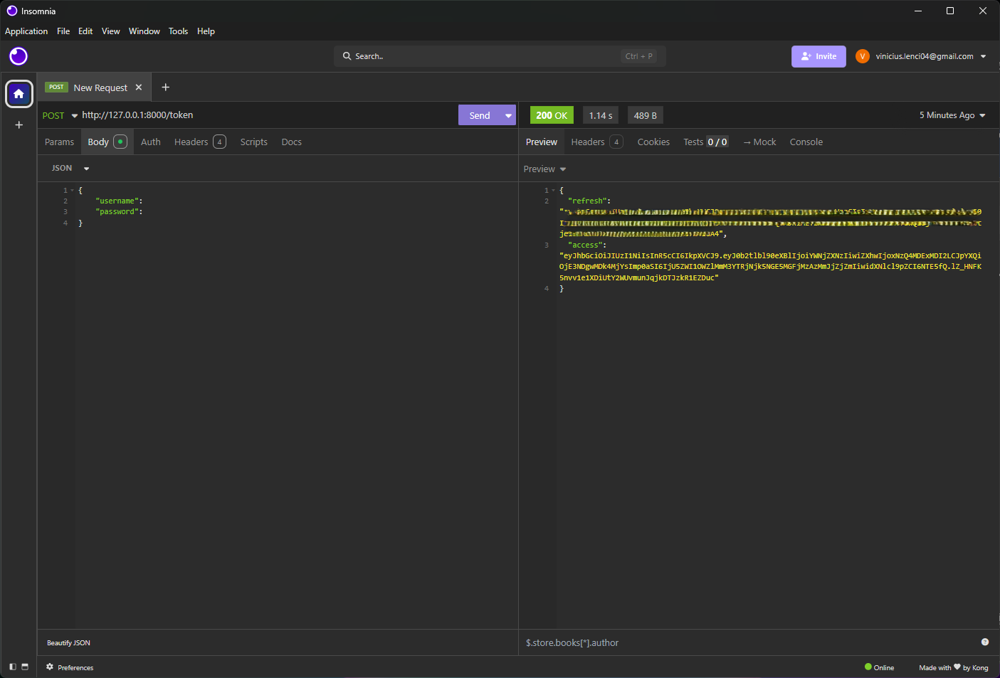

#### 8.1.2. Verify Token

* **Endpoint**: `/token/verify`
* **Method**: `POST`
* **Description**: Verifies the validity of an access token.
* **Request Body**:
    ```json
    {
      "token": "eyJhbGciOiJIUzI1NiIsInR5cCI6IkpXVCJ9..."
    }
    ```
* **Example `curl` command**:
    ```bash
    curl -X POST "http://127.0.0.1:8000/token/verify" \
         -H "Content-Type: application/json" \
         -d '{ "token": "your_access_token" }'
    ```
* **Response Example - 200 (Success)**:
    ```json
    {}
    ```
* **Response Example - 401 (Unauthorized/Error)**:
    ```json
    {
        "detail": "Token is invalid or expired",
        "code": "token_not_valid"
    }
    ```
* **Example Insomnia response**:<br>
    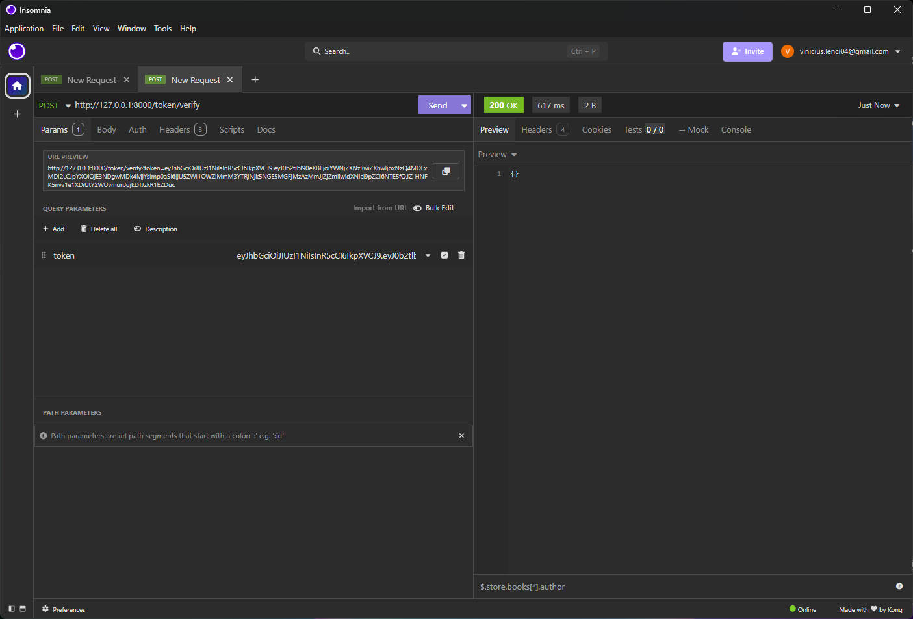

#### 8.1.3. Refresh Token

* **Endpoint**: `/token/refresh`
* **Method**: `POST`
* **Description**: Uses a refresh token to obtain a new access token.
* **Request Body**:
    ```json
    {
      "token": "eyJhbGciOiJIUzI1NiIsInR5cCI6IkpXVCJ9..."
    }
    ```
* **Example `curl` command**:
    ```bash
    curl -X POST "http://127.0.0.1:8000/token/refresh" \
         -H "Content-Type: application/json" \
         -d '{ "token": "your_refresh_token" }'
    ```
* **Response Example - 200 (Success)**:
    ```json
    {
        "access": "eyJhbGciOiJIUzI1NiIsInR5cCI6IkpXVCJ9..."
    }
    ```
* **Response Example - 401 (Unauthorized/Error)**:
    ```json
    {
        "detail": "Token is invalid or expired",
        "code": "token_not_valid"
    }
    ```
* **Example Insomnia response**:<br>
    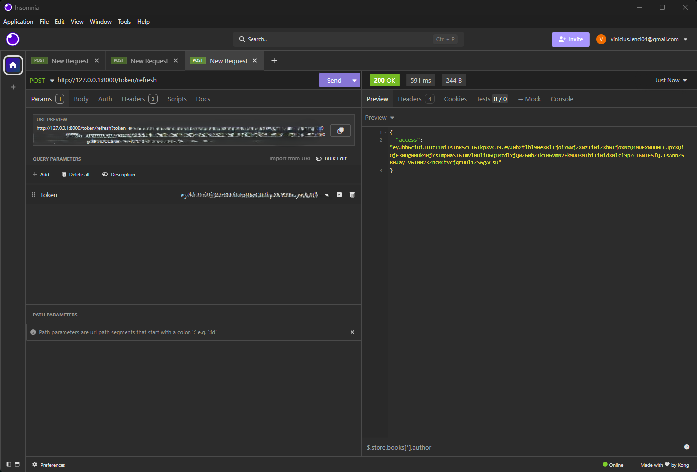

### 8.2. Data Endpoints (Requires Authentication)

#### 8.2.1. Get User Data

* **Endpoint**: `/usercorp`
* **Method**: `GET`
* **Description**: Retrieves user-specific data from the external API. Requires a valid access token.
* **Authentication**: Bearer Token in `Authorization` header.
* **Example `curl` command**:
    ```bash
    curl -X GET "http://127.0.0.1:8000/usercorp" \
         -H "Authorization: Bearer YOUR_ACCESS_TOKEN"
    ```
* **Response Example - 200 (Success)**:
    ```json
    {
        "user": {
            "id": 9901,
            "username": "fictional_user",
            "first_name": "Fictional",
            "last_name": "User",
            "email": "f.user@genericdomain.com"
        },
        "corporation": [
            {
                "id": 8801,
                "name": "Generic Corp"
            }
        ],
        "sites": [
            {
                "id": 7701,
                "name": "Alpha Site",
                "corporation": 8801
            },
            {
                "id": 7702,
                "name": "Beta Site",
                "corporation": 8801
            }
        ]
    }
    ```
* **Response Example - 403 (Forbidden/Error)**:
    ```json
    {
      "detail": "Not authenticated"
    }
    ```
* **Response Example - 403 (Forbidden/Error)**:
    ```json
    {
        "detail": "Given token not valid for any token type",
        "code": "token_not_valid",
        "messages": [
            {
                "token_class": "AccessToken",
                "token_type": "access",
                "message": "Token is invalid or expired"
            }
        ]
    }
    ```
* **Response Example - 404 (Not Found)**:
    ```json
    {
      "detail": {
        "detail": "No Site matches the given query."
      }
    }
    ```
* **Example Insomnia response**:<br>
    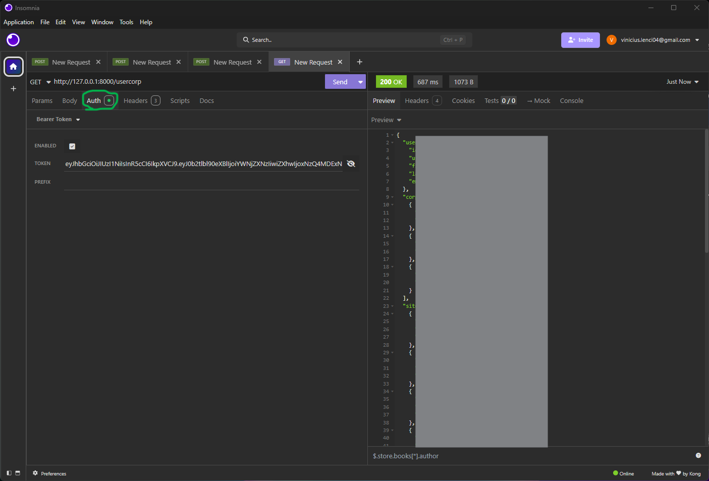

#### 8.2.2. Get Tree

* **Endpoint**: `/implantation/mobile/tree`
* **Method**: `GET`
* **Description**: Fetches a hierarchical tree structure based on a `site_id` from the external API. Requires a valid access token.
* **Query Parameters**:
    * `site_id`: Integer, the ID of the site to retrieve the tree for.
* **Authentication**: Bearer Token in `Authorization` header.
* **Example `curl` command**:
    ```bash
    curl -X GET "http://127.0.0.1:8000/implantation/mobile/tree?site_id=7701" \
         -H "Authorization: Bearer YOUR_ACCESS_TOKEN"
    ```
* **Response Example - 200 (Success)**:
    ```json
    {
        "id": 7701,
        "name": "Alpha Site",
        "revision": 105,
        "tree": [
            {
                "id": 6001,
                "asset_type": 1,
                "group": "building_section",
                "status": true,
                "name": "Main Hall",
                "tag": "MH-001",
                "level": 1,
                "order": 1,
                "parent": null,
                "site": 7701
            },
            {
                "id": 6002,
                "asset_type": 2,
                "group": "floor_level",
                "status": true,
                "name": "Ground Floor",
                "tag": "GF",
                "level": 2,
                "order": 1,
                "parent": 6001,
                "site": 7701
            },
            {
                "id": 6003,
                "asset_type": 3,
                "group": "room_unit",
                "status": false,
                "name": "Storage Room A",
                "tag": "STR-A",
                "level": 3,
                "order": 1,
                "parent": 6002,
                "site": 7701
            }
        ]
    }
    ```
* **Response Example - 403 (Forbidden/Error)**:
    ```json
    {
      "detail": "Not authenticated"
    }
    ```
* **Response Example - 403 (Forbidden/Error)**:
    ```json
    {
      "detail": {
        "detail": "Given token not valid for any token type",
        "code": "token_not_valid",
        "messages": [
          {
            "token_class": "AccessToken",
            "token_type": "access",
            "message": "Token is invalid or expired"
          }
        ]
      }
    }
    ```
* **Response Example - 404 (Not Found/Error)**:
    ```json
    {
        "detail": "Requested site or tree data not found."
    }
    ```
* **Example Insomnia response**:<br>
    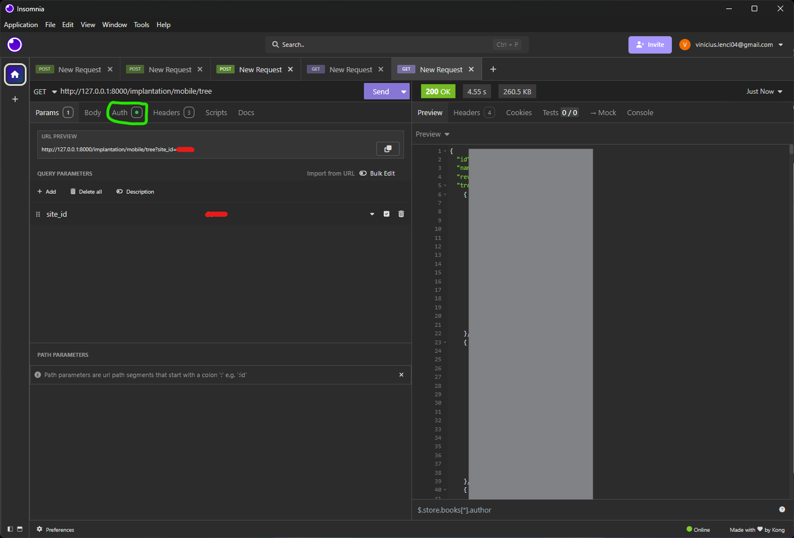

---