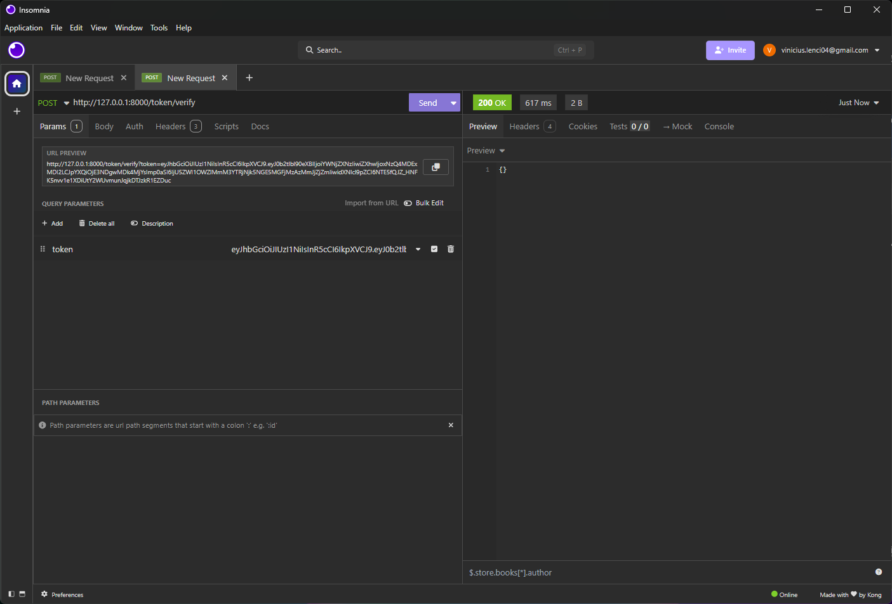

<h1 align="center">
  API Challenge - Documentation
</h1>

<h2 align="center">
  Information
</h2>
<p align="center">
    This documentation has been created to guide how to install, use and test this challenge project, which consists of a Flutter-based mobile application (frontend) and a Python FastAPI-based API (backend).
</p>

## Summary

* [1. Project Overview](#1-project-overview)
* [2. Architecture Overview](#2-architecture-overview)
* [3. Project Structure](#3-project-structure)
* [4. Getting Started](#4-getting-started)
    * [4.1. Install Git](#41-install-git)
    * [4.2. Clone the Repository](#42-clone-the-repository)
* [5. Installation Requirements](#5-installation-requirements)
    * [5.1. Frontend (Flutter)](#51-frontend-flutter)
    * [5.2. Backend (FastAPI)](#52-backend-fastapi)
* [6. How to Use](#6-how-to-use)
    * [6.1. Backend Setup and Run](#61-backend-setup-and-run)
    * [6.2. Frontend Setup and Run](#62-frontend-setup-and-run)
* [7. Authentication Flow](#7-authentication-flow)
* [8. API Call Examples](#8-api-call-examples)
    * [8.1. Authentication Endpoints](#81-authentication-endpoints)
    * [8.2. Data Endpoints (Requires Authentication)](#82-data-endpoints-requires-authentication)

## 1\. Project Overview

This project implements a mobile application with a Flutter frontend that interacts with a Python FastAPI backend. The application allows users to log in, view their user data, and query a hierarchical "tree" structure based on a site ID. The backend acts as an intermediary, handling authentication (token management) and fetching data from an external API.

## 2\. Architecture Overview


## 3\. Project Structure

The repository is organized as follows:

```
desafio-api-python/
│
├── app/                    # FastAPI Backend
│   ├── auth/               # Authentication modules (handlers, models)
│   │   ├── handlers.py     # Token handling logic
│   │   └── models.py       # Pydantic models for authentication
│   ├── routes/             # API endpoint definitions
│   │   └── endpoints.py
│   ├── services/           # Logic for integration with the external API
│   │   └── portal.py
│   ├── main.py             # Main FastAPI application file
│   ├── config.py           # Configuration and environment variables
│   └── .env                # File for environment variables (not versioned)
│
├── frontend_flutter/       # Flutter Application
│   ├── lib/                # Main source code of the application
│   │   ├── main.dart       # Entry point of the Flutter app
│   │   ├── pages/          # Screen widgets (Login, Home, User, Tree)
│   │   ├── providers/      # State management (AuthProvider)
│   │   ├── services/       # API communication logic (ApiService)
│   │   └── models/         # Frontend data models
│   ├── android/            # Android platform-specific files
│   ├── ios/                # iOS platform-specific files
│   └── pubspec.yaml        # Flutter project dependencies and metadata
│
├── readme_images/          # Images used in the README
│
├── .gitignore              # Files and directories ignored by Git
├── README.md               # This documentation file
└── requirements.txt        # Python dependencies for the backend
```

## 4\. Getting Started

To begin, you need to have Git installed on your system to clone the repository.

### 4.1. Install Git

If you don't have Git installed, download and install it from the official website: [Git Downloads](https://git-scm.com/downloads).

### 4.2. Clone the Repository

Once Git is installed, open your terminal or command prompt and run the following command:

```bash
git clone https://github.com/vlenci/desafio-api-python.git
cd desafio-api-python
```

After cloning, navigate into the project directory.

-----

## 5\. Installation Requirements

To set up and run this project, you need to install the following dependencies for both the frontend and the backend.

### 5.1. Frontend (Flutter)

The Flutter frontend requires the Flutter SDK and a few Dart packages.

  * **Flutter SDK**:
    Install Flutter by following the official guide: [Flutter Get Started](https://flutter.dev/docs/get-started)

  * **Dart Packages**:
    The following packages are listed in `frontend_flutter/pubspec.yaml`:

      * `http`: Used for making HTTP requests to the backend.
      * `provider`: A state management solution for Flutter.

    These packages will be installed automatically when you run `flutter pub get` in the `frontend_flutter` directory.

### 5.2. Backend (FastAPI)

The FastAPI backend is a Python application.

  * **Python**:
    Ensure you have Python 3.8+ installed. You can download it from the official Python website.

  * **Python Packages**:
    The backend dependencies are listed in the `requirements.txt` file. To install them, navigate to the project's root directory (`desafio-api-python/`) and run:

    ```bash
    pip install -r requirements.txt
    ```

    The `requirements.txt` file contains:

    ```
    fastapi
    uvicorn
    requests
    python-dotenv
    pydantic
    ```

-----

## 6\. How to Use

Follow these steps to get the frontend and backend applications running.

### 6.1. Backend Setup and Run

1.  **Navigate to the project's root directory**:
    Ensure you are in the main `desafio-api-python` directory (the one containing both `app` and `frontend_flutter`).

2.  **Important Note for Testers**:
    To fully test the application, you will need credentials for an external API (`API_EXTERNAL_URL`, `API_USERNAME`, `API_PASSWORD`) which are configured in the `.env` file. Please contact the project owner to obtain these credentials.

3.  **Create a `.env` file**:
    The backend uses `python-dotenv` to load environment variables from a `.env` file. Create a file named `.env` **inside the `app/` directory** with the following content, using the credentials obtained as mentioned above:

    ```
    API_EXTERNAL_URL=<YOUR_EXTERNAL_API_BASE_URL>
    API_USERNAME=<YOUR_EXTERNAL_API_USERNAME>
    API_PASSWORD=<YOUR_EXTERNAL_API_PASSWORD>
    ```

    Replace `<YOUR_EXTERNAL_API_BASE_URL>`, `<YOUR_EXTERNAL_API_USERNAME>`, and `<YOUR_EXTERNAL_API_PASSWORD>` with the actual credentials.

4.  **Run the FastAPI application**:
    From the **root directory** of the project (e.g., `desafio-api-python`), run the following command:

    ```bash
    uvicorn app.main:app --reload
    ```

    This will start the FastAPI server, typically accessible at `http://127.0.0.1:8000` by default. The `--reload` flag enables auto-reloading on code changes.

### 6.2. Frontend Setup and Run

1.  **Navigate to the frontend directory**:
    From the project's root directory, navigate to the frontend:

    ```bash
    cd frontend_flutter
    ```

2.  **Get Flutter packages**:

    ```bash
    flutter pub get
    ```

3.  **Ensure the backend is running**:
    The Flutter app connects to the backend at `http://10.0.2.2:8000` (for Android emulator). Make sure your FastAPI backend is accessible from this address or update the `baseUrl` in `frontend_flutter/lib/services/api_service.dart` if your backend is running on a different IP/port.

4.  **Run the Flutter application**:
    You can run the application on an attached device or emulator:

    ```bash
    flutter run
    ```

    Or, for a specific device:

    ```bash
    flutter run -d <device_id>
    ```

-----

## 7\. Authentication Flow

The authentication process uses JWT (JSON Web Tokens) and involves the following steps:

1.  **Login (`/token`)**:

      * The user provides `username` and `password` via the frontend.
      * The backend authenticates these credentials against the external API.
      * If successful, the backend generates two tokens:
          * `access_token`: A short-lived token used to authenticate subsequent requests to protected endpoints.
          * `refresh_token`: A longer-lived token used to obtain a new `access_token` when the current one expires, without requiring the user to log in again.
      * Both tokens are sent back to the frontend.

2.  **Using the Access Token**:

      * For every request to a protected endpoint (e.g., `/usercorp`, `/implantation/mobile/tree`), the frontend must include the `access_token` in the `Authorization` header as a Bearer token:
        ```
        Authorization: Bearer YOUR_ACCESS_TOKEN
        ```
      * The backend validates this token before processing the request.

3.  **Token Validation (`/token/verify`)**:

      * This endpoint can be used to check if an `access_token` is still valid.
      * The frontend sends the `access_token`.
      * The backend verifies its signature and expiration. It returns a confirmation or an error.

4.  **Token Renewal (`/token/refresh`)**:

      * When an `access_token` expires, or is about to expire, the frontend can use the `refresh_token` to request a new `access_token`.
      * The frontend sends the `refresh_token` to the `/token/refresh` endpoint.
      * The backend validates the `refresh_token`. If valid, it issues a new `access_token` (and potentially a new `refresh_token`, though this implementation seems to issue only a new access token).
      * This allows the user to stay logged in for an extended period without re-entering credentials, as long as the refresh token remains valid and secure.

5.  **Token Expiration and Logout**:

      * If the `access_token` is expired and the `refresh_token` is also invalid or expired, the user must log in again.
      * Securely storing tokens on the client-side (e.g., using secure storage mechanisms) is crucial.

This token-based authentication flow enhances security by minimizing the exposure of user credentials and providing a standard way to manage session validity.

-----

## 8\. API Call Examples

The FastAPI backend exposes several endpoints. All authenticated endpoints require an `Authorization` header with a Bearer token.

**Base URL**: `http://127.0.0.1:8000` (or wherever your FastAPI app is running)

### 8.1. Authentication Endpoints

#### 8.1.1. Login (Get Token)

  * **Endpoint**: `/token`
  * **Method**: `POST`
  * **Description**: Authenticates a user and returns access and refresh tokens.
  * **Request Body**:
    ```json
    {
      "username": "your_username",
      "password": "your_password"
    }
    ```
  * **Example `curl` command**:
    ```bash
    curl -X POST "http://127.0.0.1:8000/token" \
         -H "Content-Type: application/json" \
         -d '{ "username": "your_username", "password": "your_password" }'
    ```
  * **Example Insomnia response**:<br>
    

#### 8.1.2. Verify Token

  * **Endpoint**: `/token/verify`
  * **Method**: `POST`
  * **Description**: Verifies the validity of an access token.
  * **Request Body**:
    ```json
    {
      "token": "your_access_token"
    }
    ```
  * **Example `curl` command**:
    ```bash
    curl -X POST "http://127.0.0.1:8000/token/verify" \
         -H "Content-Type: application/json" \
         -d '{ "token": "your_access_token" }'
    ```
  * **Example Insomnia response**:<br>
    

#### 8.1.3. Refresh Token

  * **Endpoint**: `/token/refresh`
  * **Method**: `POST`
  * **Description**: Uses a refresh token to obtain a new access token.
  * **Request Body**:
    ```json
    {
      "token": "your_refresh_token"
    }
    ```
  * **Example `curl` command**:
    ```bash
    curl -X POST "http://127.0.0.1:8000/token/refresh" \
         -H "Content-Type: application/json" \
         -d '{ "token": "your_refresh_token" }'
    ```
  * **Example Insomnia response**:<br>
    

### 8.2. Data Endpoints (Requires Authentication)

#### 8.2.1. Get User Data

  * **Endpoint**: `/usercorp`
  * **Method**: `GET`
  * **Description**: Retrieves user-specific data from the external API. Requires a valid access token.
  * **Authentication**: Bearer Token in `Authorization` header.
  * **Example `curl` command**:
    ```bash
    curl -X GET "http://127.0.0.1:8000/usercorp" \
         -H "Authorization: Bearer YOUR_ACCESS_TOKEN"
    ```
  * **Example Insomnia response**:<br>
    

#### 8.2.2. Get Implantation Tree

  * **Endpoint**: `/implantation/mobile/tree`
  * **Method**: `GET`
  * **Description**: Fetches a hierarchical tree structure based on a `site_id` from the external API. Requires a valid access token.
  * **Query Parameters**:
      * `site_id`: Integer, the ID of the site to retrieve the tree for.
  * **Authentication**: Bearer Token in `Authorization` header.
  * **Example `curl` command**:
    ```bash
    curl -X GET "http://127.0.0.1:8000/implantation/mobile/tree?site_id=123" \
         -H "Authorization: Bearer YOUR_ACCESS_TOKEN"
    ```
  * **Example Insomnia response**:<br>
    

